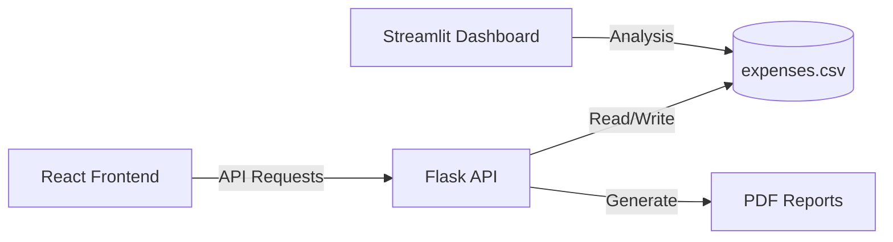

# 💰 ExpenseX - Premium Financial Intelligence


**ExpenseX** is a cutting-edge, full-stack financial dashboard designed to track, analyze, and visualize spending patterns with precision. It features a high-performance **React frontend** and a robust **Python/Flask backend**, perfectly balanced for performance and scale.

🔗 **Live Demo:** [View Live App](https://expense-tracker-po18a8v93-shrutibedve10-3390s-projects.vercel.app)

---

## ✨ Core Features

### 🌐 Sophisticated Web Interface (React)
- **Glassmorphism UI**: A premium dark-mode experience with blurred surfaces and vibrant gradients.
- **Full CRUD Support**: Instant transaction adding and deletion with real-time UI updates.
- **Advanced Filtering**: Search and filter records by category (Food, Rent, Salary, etc.) or description.
- **Responsive Visuals**: Interactive data visualization powered by **Recharts**.

### 📊 Python Intelligence & Analytics
- **RESTful API**: A Flask-powered backend serving structured financial data.
- **Analytics Dashboard**: A dedicated **Streamlit** app for deep statistical insights.
- **Professional PDF Reports**: One-click generation of beautifully formatted financial statements.
- **Localized for India**: Full support for the **Indian Rupee (₹)** currency format.

---

## 🏗️ Technical Architecture



---

## 📂 Project Structure

```text
expense-tracker-app/
├── backend/
│   ├── data/            # Persistence layer (CSV)
│   ├── api.py           # Flask REST API
│   ├── app.py           # Streamlit Analytics app
│   ├── outputs/         # Generated reports
│   └── requirements.txt # Python dependencies
├── frontend/
│   ├── src/             # Premium React components
│   ├── public/          # Static assets
│   └── package.json     # Node dependencies
└── README.md
```

---

## ⚙️ Local Development

### 1. API Server (Required)
```powershell
cd backend
python -m venv venv
.\venv\Scripts\activate
pip install -r requirements.txt
python api.py
```

### 2. Frontend Dashboard
```powershell
cd frontend
npm install
npm run dev
```

### 3. Analytics Helper (Optional)
```powershell
cd backend
.\venv\Scripts\activate
streamlit run app.py
```

---

## 🚀 Cloud Deployment

### Backend (Render)
1. Create a new **Web Service** on Render.
2. Connect this repository.
3. **Build Command:** `pip install -r requirements.txt`
4. **Start Command:** `gunicorn api:app`

### Frontend (Vercel)
1. Create a new project on Vercel.
2. Add an **Environment Variable**: `VITE_API_BASE_URL` = `https://your-render-app.onrender.com`.
3. Deploy!

---

## 📄 License
This project is licensed under the MIT License - see the [LICENSE](LICENSE) file for details.

Developed with ❤️ by [Shruti Bedve](https://github.com/shrutibedve)
